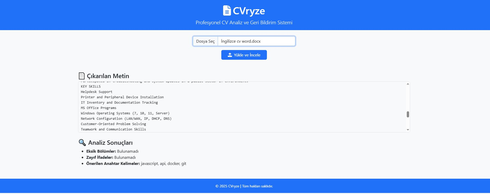

# 📄 CVryze - CV Analiz ve Öneri Sistemi

CVryze, kullanıcıların özgeçmişlerini analiz eden ve geliştirmeleri için öneriler sunan bir uygulamadır. Amaç, profesyonel ve etkili CV'ler hazırlanmasına yardımcı olmaktır.

> ⚠️ **Uyarı:** Bu proje hâlihazırda geliştirme aşamasındadır. Dosyalar tam olarak çalışmayabilir ve sistem henüz stabil değildir. Aktif geliştirme süreci devam etmektedir.

---

## 📷 Uygulama Görüntüsü




## 🧱 Proje Yapısı

- **src/** – Python tabanlı CV analiz modülleri
- **models/** – Model ve algoritma dosyaları (OCR, NLP vb.)
- **tests/** – Test dosyaları (planlanıyor)
- **docs/** – Dokümantasyon (yapım aşamasında)

---

## 🚀 Başlangıç (Python Ortamı)

```bash
cd src
python -m venv venv
venv\Scripts\activate    # macOS/Linux: source venv/bin/activate
pip install -r requirements.txt
python main.py           # veya projenin başlangıç dosyası
🛠️ Gereksinimler
Python 3.9 veya üzeri

Tesseract OCR (Sistem PATH'inde kurulu olmalı)

OpenCV

Pytesseract

Diğer Python kütüphaneleri (requirements.txt içinde)

Not: requirements.txt dosyası güncellenmektedir.

✅ Durum
Modül	Gelişme Durumu
CV OCR Modülü	🟢 Başlangıç Yapıldı
Öneri Sistemi	🔴 Geliştirme Aşamasında
Kullanıcı Arayüzü	🔴 Henüz Oluşturulmadı
Testler	🔴 Planlama Aşamasında

📌 Notlar
Proje bir üniversite projesi olarak geliştirilmekte olup, bazı fonksiyonlar eksik veya hatalı olabilir.

Katkıda bulunmak isteyenler lütfen önce bir issue açsın.

Tesseract'ın bilgisayarınıza kurulu ve PATH’e ekli olduğundan emin olun.

